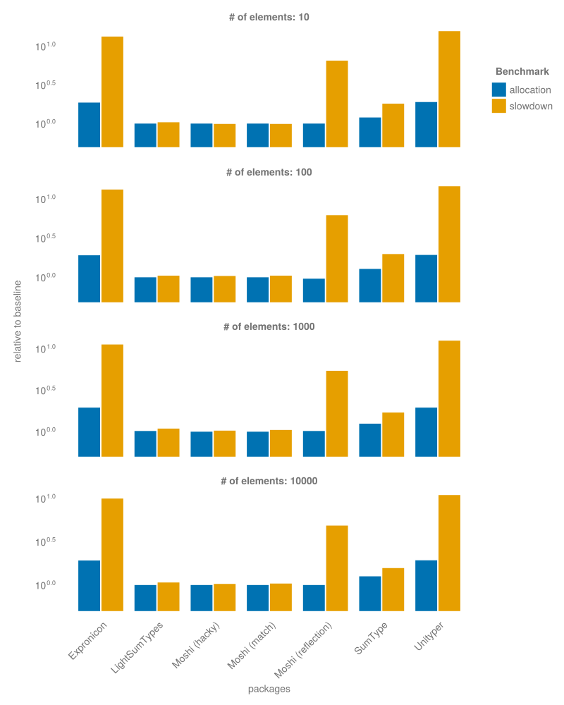

# Moshi

[](https://github.com/Roger-luo/Moshi.jl/actions/workflows/CI.yml)
[](https://codecov.io/gh/Roger-luo/Moshi.jl)
[![][docs-img]][docs-url]

Moshi is the pattern in Chinese （模式）. This package is the refactor of MLStyle with

- more correct pattern language for pattern match with `@match`
- type-stable algebra data type/tagged union with generics via `@data`
- traits, derive macro `@derive` from rust

> [!IMPORTANT]
>
> This project is in the early stage of development. The macro syntax has been iterated acorss several packages including Expronicon, MLStyle. The syntax are mostly stable. However, the API and features are subject to change.

## Installation

<p>
Moshi is a &nbsp;
    <a href="https://julialang.org">
        
        Julia Language
    </a>
    &nbsp; package. To install Moshi,
    please <a href="https://docs.julialang.org/en/v1/manual/getting-started/">open
    Julia's interactive session (known as REPL)</a> and press <kbd>]</kbd>
    key in the REPL to use the package mode, then type the following command
</p>

```julia
pkg> add Moshi
```

## Quick Example

Here is a quick example of defining a simple algebraic data type:

```julia
using Moshi.Data: @data

@data Message begin
    Quit
    struct Move
        x::Int
        y::Int
    end

    Write(String)
    ChangeColor(Int, Int, Int)
end
```

For pattern matching, if you already used `MLStyle`, the syntax is very similar:

```julia
using Moshi.Match: @match

@match [1.0, 2, 3] begin
    [1, xs::Float64...] => xs
end

@match (1, 2.0, "a") begin
    (1, x::Int, y::String) => x
    (1, x::Real, y::String) => y
end
```

## Benchmark



## License

MIT License


[docs-img]: https://img.shields.io/badge/docs-blue.svg
[docs-url]: https://rogerluo.dev/Moshi.jl/
